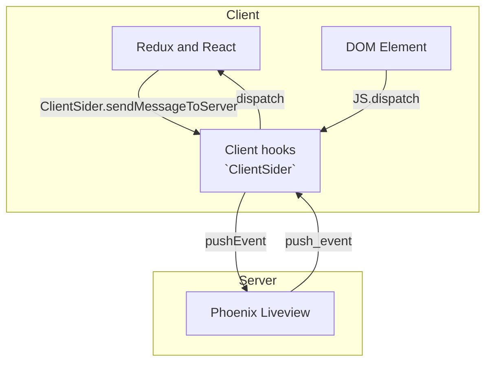

# PhxReduxExample

To start your Phoenix server:

- Install dependencies with `mix deps.get`
- Start Phoenix endpoint with `mix phx.server` or inside IEx with `iex -S mix phx.server`

Now you can visit [`localhost:4000`](http://localhost:4000) from your browser.

Ready to run in production? Please [check our deployment guides](https://hexdocs.pm/phoenix/deployment.html).

## Architecture

## How to copy redux system to your repo

1. Clone this repo.
2. In your repo, replace `app.js` to `app.ts` in `config/config.exs`.
3. Copy `assets` to your repo.
4. Copy `aliases.npm_install` in `mix.exs`.
5. Edit `aliases.setup` in `mix.exs`.
6. Run `mix setup` in your repo.

## How to edit redux system

Edit these files.

- `js/hooks/client-sider.tsx`
  - You must edit them.
    - `ClientSider.setupServerToClientHandling`
    - `ClientSider.setupClientToClientHandling`
- `js/redux/features/**/*`
- `js/redux/page-components/**/*`
